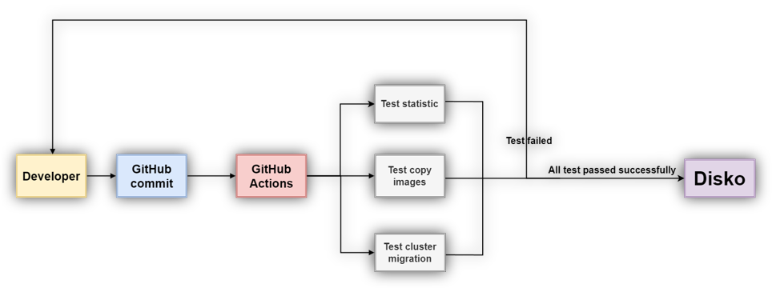

# Disko Project: Managing Docker Images in the Cloud
### Collaboration with Octopus Computer Solutions

## Table of contents
  1. [Background and Problem](#Background-and-Problem)
  2. [Overview](#Overview)
  3. [Technologies used](#Technologies-used)
  4. [Architecture](#Architecture)

## Background and Problem
Managing operations in disconnected environments requires specialized tools that do not rely on internet access. The Disko project was designed to provide an automated and efficient solution for managing **Docker Images** in air-gapped environments while addressing key challenges such as:
- **Automated Testing:** Implementing a CI/CD pipeline to ensure code stability and prevent failures caused by changes.
- **Image Migration:** Modifying Docker Images for all Pods in a Kubernetes environment from one registry to another without disrupting the current Cluster's functionality.

## Overview
Disko is an open-source tool (in development) designed to streamline and simplify operations in disconnected environments. It offers three main features:
1. Displaying statistics of **Docker Images** by registry.
2. Copying **Images** from one registry to another.
3. Migrating **Images** within a Kubernetes environment by modifying the Pods’ images to match the target registry.

### Implementation and Contribution:
During the project, I led a development team focusing on automation and advanced testing. We implemented CI/CD processes and tools like GitHub Actions, alongside developing Unit Tests to ensure continuous verification of system functionality.
The project was successfully submitted and evaluated by the Israeli Ministry of Labor, Social Affairs and Social Services (Mahat) as part of my studies at ORT Tel Aviv College.

### Contribution to the Community:
The project was initially developed for internal use by Octopus Computer Solutions. Now that it is expected to become open-source, I am proud to have contributed to its development and to the world of open-source software.

## Technologies used

  &nbsp;&nbsp;
  &nbsp;&nbsp;
  &nbsp;&nbsp;
  &nbsp;&nbsp;
  &nbsp;&nbsp;
  &nbsp;&nbsp;
  

- Kubernetes
- Helm
- Python
- PyTest
- GitHub Action - CI/CD
- Docker
- YAML

## Achitecture

